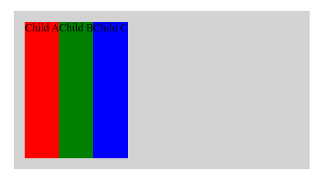
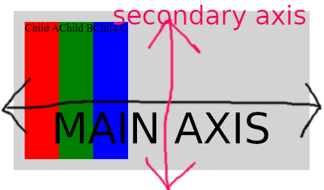
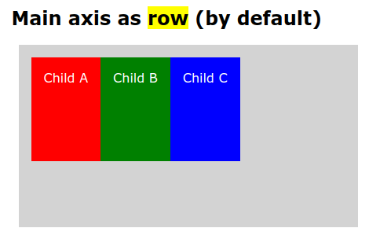
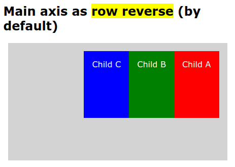
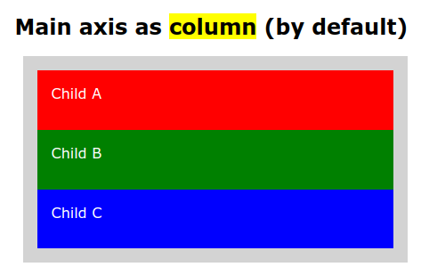
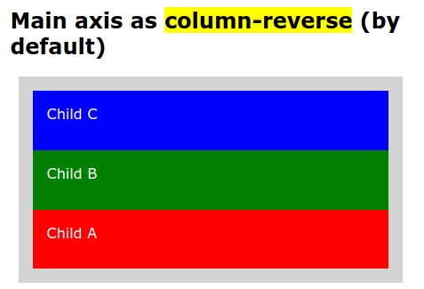

# FLEXBOX TRAINING

> **Required**: CSS and HTML knowledge

## SUMMARY

- **Rule 1**: It's required one parent container(flex-container) and at least one child(flex-item).

## INTRODUCTION

This is just for training and remembering about flexbox with some documentation. It's made following Udemy course "Curso de FlexBox desde 0" that I recommend you if you are spanish talker: [Free CSS Flexbox Tutorial - Curso de FlexBox desde 0 | Udemy](https://www.udemy.com/course/curso-de-flexbox-desde-0). At this moment is free and very well explained. Author Erick Mines purpose us 10 gold rules to understanding the flexbox system of layout of css module since CSS3 version to get "flexible boxes" in order to do responsive design for all kind of interfaces, sizes and every device.

## Rule 1: One Flex-container & at least 1 flex-item

It's required one parent container element(<mark>flex-container</mark>) and at least one child element(<mark>flex-item</mark>).

### Example

In our **html** we have a flex-container(*flexible-father*) and inside several childs(*flexible-child-#*):

```html
<section class="flexible-father">
    <article class="flexible-child-1">Child A</article>
    <article class="flexible-child-2">Child B</article>
    <article class="flexible-child-3">Child C</article>
</section>
```

In our **css** we just need to declare the ***<mark>display:flex;</mark>*** property as it follows inside flex-container set of rules;

```css
/* This is the flex-container */
        .flexible-father {
            display: flex;
            background: lightgrey;
            max-width: 400px;
            margin: 0 auto;
            padding: 1rem;
        }

        .flexible-father>* {
            height: 200px;
        }

        /* These are the flex-items */
        .flexible-child-1 {
            background: red;
        }

        .flexible-child-2 {
            background: green;
        }

        .flexible-child-3 {
            background: blue;
        }
```

That is what we get:



## Rule 2: Flexbox has 2 axis (main axis and secondary axis).



Main axis is where child elements of a flex container are distributed. And by default, as we see  along a **row** even if they are ***block*** elements (like in this case that child elements are article that is a block element in HTML). 

But we could change direction of main axis by adding property **flex-direction** with following values: ***row***, ***row-reverse***, ***column***, ***column-reverse***. 



```css
.flexible-father {
    flex-direction:row;
}
```




```css
.flexible-father {
    flex-direction:row-reverse;
}
```




```css
.flexible-father {
    flex-direction:column;
}
```




```css
.flexible-father {
    flex-direction:column-reverse;
}
```
